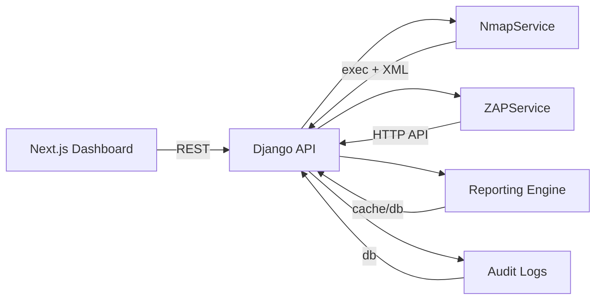

# PEN-T: A Unified Penetration Testing Framework Integrating Nmap and OWASP ZAP with Proactive Reporting

Authors: [Your Name], [Affiliation]

Keywords: penetration testing, Nmap, OWASP ZAP, vulnerability scanning, Django, Next.js, reporting, audit logs

## Abstract

We present PEN-T, an extensible penetration testing framework that unifies network reconnaissance and web application vulnerability assessment using Nmap and OWASP ZAP. The system provides a Django-based backend offering REST endpoints for scan orchestration, a modern Next.js frontend for interactive dashboards, and a proactive reporting system that streamlines creation of individual and comprehensive PDF-ready reports. We describe the system architecture, implementation, and workflows for port scanning, vulnerability scanning, and combined assessments, along with audit logging for governance. We evaluate scan performance and discuss design trade‑offs, limitations, and future improvements including parallel multi-target scanning, advanced ZAP policies, and first-class PDF export.

## 1. Introduction

Security assessments often require combining multiple tools across network and application layers. Practitioners routinely pivot between Nmap for network reconnaissance and ZAP for web application testing, introducing friction and hindering repeatability. PEN-T addresses this by:
- Integrating Nmap and ZAP into a single workflow with consistent abstractions.
- Providing RESTful orchestration for automation and CI/CD scenarios.
- Offering a unified UI with real-time progress and result visualization.
- Enforcing governance with audit logs and a proactive reporting system.

## 2. System Overview

- **Backend (Django 5.x)**: Provides API endpoints for scan initiation, status, cancellation, reporting, and audit logs. Core services include `NmapService` and `ZAPService` (`backend/api/nmap_service.py`, `backend/api/zap_service.py`). Data persistence uses SQLite by default and incorporates `AuditLog` and `UserProfile` models.
- **Frontend (Next.js 15, React 19, Tailwind)**: Implements dashboards for reconnaissance, scanning, exploitation, audit logs, and reporting under `app/dashboard/*`. Real-time progress and result rendering are implemented with modern UI components.
- **Reporting**: Proactive prompts invite users to save results as individual reports and combine them into comprehensive assessments; placeholder PDF export endpoints exist.
- **Auditability**: All key actions can be captured as audit logs with severity, module, and metadata.

### 2.1 Architecture Diagram (conceptual)



## 3. Methods and Workflows

### 3.1 Port Scanning (Nmap)
- Command synthesis with performance-aware flags (quick, full, stealth, aggressive). Timing templates and optional ports/scripts are incorporated.
- Execution via `subprocess`; results are captured in XML and text, then parsed (`xml.etree.ElementTree`).
- Parsed artifacts include total/open ports, protocol, service metadata (product/version), and optional OS guess.
- Endpoints: `POST /api/scan/port/`, `GET /api/scan/nmap/status/{scan_id}/`, `POST /api/scan/nmap/cancel/{scan_id}/`.

### 3.2 Vulnerability Scanning (OWASP ZAP)
- Orchestration via ZAP’s JSON API: context creation, spidering, and active scanning.
- Progress polling until completion or timeout; results assembled from `alerts` and discovered URLs.
- Endpoints: `POST /api/scan/vulnerability/`, `GET /api/scan/zap/status/{scan_id}/`, `POST /api/scan/zap/cancel/{scan_id}/`.

### 3.3 Comprehensive Scan
- Sequential composition: Nmap port scan followed by ZAP vulnerability assessment.
- Unified progress reporting and combined result payloads via `POST /api/scan/comprehensive/`.

### 3.4 Tool Availability and Health
- `GET /api/scan/tools/availability/` validates Nmap installation and ZAP daemon connectivity.

## 4. Implementation Details

### 4.1 Backend Services
- `NmapService` (`backend/api/nmap_service.py`):
  - Locate `nmap` binary across platforms; report version/path.
  - Build commands per scan type with timing controls; output to temp files (`-oX`, `-oN`).
  - Parse XML to extract ports, services, and OS guess; maintain in-memory scan registry; expose status/progress.
- `ZAPService` (`backend/api/zap_service.py`):
  - Session-based client, optional API key.
  - Endpoints for spider and active scan orchestration; wait loops with timeouts.
  - Summarize alerts by risk (critical/high/medium/low) and discovered URL counts.

### 4.2 API Endpoints (selected)

```http
GET  /api/scan/tools/availability/
POST /api/scan/port/
GET  /api/scan/nmap/status/{scan_id}/
POST /api/scan/nmap/cancel/{scan_id}/
POST /api/scan/vulnerability/
GET  /api/scan/zap/status/{scan_id}/
POST /api/scan/zap/cancel/{scan_id}/
POST /api/scan/comprehensive/

GET  /api/reports/individual/
POST /api/reports/save-individual/
GET  /api/reports/comprehensive/
POST /api/reports/comprehensive/generate/
POST /api/reports/{type}/{id}/download/
```

### 4.3 Data Model
- `AuditLog(timestamp, user, action, module, status, severity, ip_address, user_agent, details, metadata, session_id)` with indexes for query performance.
- `UserProfile(user, role)` for role-based annotation.

### 4.4 Frontend
- Next.js app routes under `app/dashboard/*` for scanning, reconnaissance, exploitation, users, reports, and audit-logs.
- Proactive report prompts provided by a global provider and hook, shown on scan completion with auto-generated severity and counts.

### 4.5 Configuration
- ZAP defaults: `http://localhost:8080`, API key optional.
- Nmap: no API key; local CLI must be available in `PATH`.
- SQLite is default; can be substituted with production databases.

## 5. Proactive Reporting System

- After each scan completes, users are prompted to save an individual report with title and summary.
- Individual reports can be combined into a comprehensive report with an executive summary, findings aggregation, recommendations, and a risk assessment scaffold.
- Severity logic varies by scan type: vulnerability counts, number of open ports, or informational-only for DNS.
- Endpoints support listing, fetching detail, deleting, generating comprehensive reports, and PDF download placeholders.

## 6. Evaluation

### 6.1 Performance
- Representative timings (single target):
  - Port scan (1–1000): ~30–60s
  - Vulnerability scan: ~2–5m
  - Comprehensive scan: ~3–7m
- Resource usage: ~50–200MB memory per scan; moderate CPU during active scanning.

### 6.2 Reliability and Error Handling
- Availability checks and explicit error messages for missing tools or daemon connectivity.
- Timeouts and cancellation endpoints for long-running scans.

### 6.3 Usability
- Unified UI with real-time progress and structured results.
- Proactive prompts reduce lost context and encourage report capture.

### 6.4 Security and Compliance
- Explicit guidance to scan only authorized systems.
- Audit logs for governance; role tagging via `UserProfile`.

## 7. Related Work

- Standalone tools: Nmap, OWASP ZAP, Nikto, sqlmap.
- Suites: OpenVAS/Greenbone, Burp Suite, commercial platforms.
- PEN-T’s contribution is orchestration and cohesive UX that bridges network and application layers with proactive reporting.

## 8. Limitations

- Single-target scan orchestration per request; limited parallelism.
- PDF generation is a placeholder; comprehensive formatting not finalized.
- In-memory scan registries limit durability without a backing queue/store.
- SQLite by default; production requires hardened configuration.

## 9. Future Work

- Parallel multi-target scanning and scheduling.
- Advanced ZAP policies and custom scripts (NSE and ZAP add-ons).
- First-class PDF/HTML report generation with templates.
- Caching of repeated scans and differential reporting.
- Integration APIs for SIEM/issue trackers.

## 10. Conclusion

PEN-T unifies network and web application assessments into a single, automatable workflow with real-time monitoring, governance, and proactive reporting. By combining Nmap and ZAP under a common API with a modern UI, it lowers operational friction and increases repeatability. Ongoing work will expand scale, report quality, and integration breadth.

## 11. Availability and Setup

- Backend: Django 5.x (`backend/`), SQLite default.
- Frontend: Next.js 15, React 19 (`app/`), Tailwind.
- Tools: Nmap CLI and ZAP daemon must be installed locally.
- Quick start (examples):

```bash
# ZAP (daemon)
zap.sh -daemon -port 8080 -config api.disablekey=true

# Nmap check
nmap --version
```

## References

[1] Nmap Project. “Nmap Reference Guide.” Available at the official Nmap documentation.

[2] OWASP. “Zed Attack Proxy (ZAP) Documentation.” Available at official OWASP ZAP docs.

[3] Django Software Foundation. “Django Documentation.” Available at official Django docs.

[4] Vercel. “Next.js Documentation.” Available at official Next.js docs.